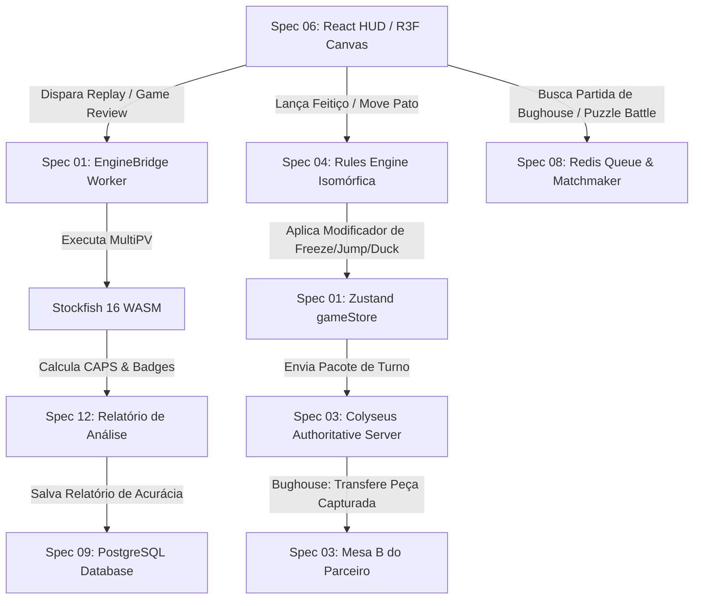
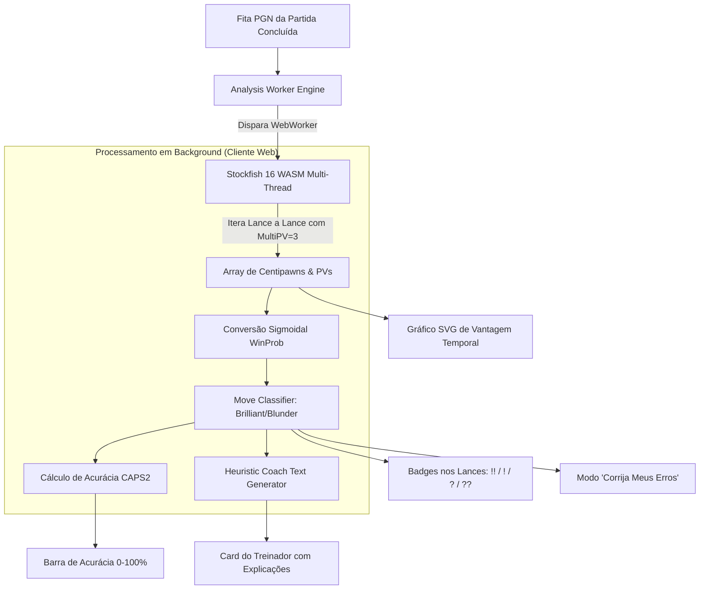
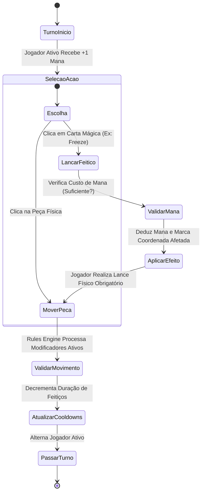

# Spec 12: Suíte de Análise de Partidas (Game Review), Minijogos e Spell Chess

## A. OBRIGAÇÃO DE DENSIDADE E ABORDAGEM
Uma das maiores forças que consagrou o Chess.com como líder mundial não foi apenas o ato de mover peças em 64 casas, mas o rico ecossistema de **Game Review (Análise Pós-Jogo com classificação de lances e acurácia CAPS)** e sua vasta biblioteca de **Minijogos Táticos e Variantes Inovadoras**, com destaque absoluto para o **Spell Chess (Xadrez com Feitiços Mágicos)**, **Duck Chess (Xadrez do Pato)**, **Bughouse (Xadrez de Duplas 2v2)** e **Puzzle Rush / Battle**.

Entretanto, o Chess.com restringe suas ferramentas mais poderosas de análise profunda (Game Review ilimitado, relatórios de precisão e coach virtual) a planos de assinatura pagos (planos Ouro, Platina e Diamante, variando entre R$ 39,90 e R$ 69,90 mensais). Esta **Spec 12** formaliza como o `ChessInReact` entrega **100% dos recursos do Chess.com e muito mais**, de forma **totalmente aberta, gratuita ($0/mês) e descentralizada no navegador do usuário**, integrando perfeitamente as mecânicas com todas as outras 11 especificações arquiteturais da plataforma.

---

## 1. MATRIZ COMPARATIVA EXPANDIDA: CHESS.COM VS CHESSINREACT

A tabela abaixo audita a cobertura completa de funcionalidades do Chess.com frente à engenharia do `ChessInReact`:

| Funcionalidade / Recurso | Chess.com (Comercial / Pago) | ChessInReact (Nossa Plataforma Aberta) | Onde Está Documentado no Projeto |
|---|---|---|---|
| **Partidas Online Ranqueadas (1v1 Clássico)** | Sim (Proprietário) | Sim (Autoritativo via Colyseus e WebSockets) | Specs 03 e 08 |
| **Arena de Bots com Ratings (0 a 2200+)** | Sim (Bots fixos com avatares) | Sim (19 Bots calibrados + Bots que aprendem com erros) | Spec 11 |
| **Game Review Completo (Brilliant, Blunder)** | 🔒 Pago (Limitado a 1/dia grátis) | **100% Gratuito e Ilimitado (Stockfish WASM no Browser)** | **Spec 12 (Esta Spec)** |
| **Cálculo de Acurácia CAPS2 (0% a 100%)** | Sim (Fórmula fechada) | Sim (Fórmula sigmoidal CAPS2 aberta e determinística) | **Spec 12 (Esta Spec)** |
| **Gráfico Interativo de Vantagem Posicional** | Sim (Linha temporal de centipawns) | Sim (SVG/Canvas reativo atrelado ao slider de lances) | **Spec 12 (Esta Spec)** |
| **Modo "Corrija Seus Erros" (Retry Mistakes)** | 🔒 Exclusivo Plano Diamante | **Gratuito no Cliente (Desafio interativo pós-jogo)** | **Spec 12 (Esta Spec)** |
| **Coach Virtual com Explicações em Texto** | Sim (Comentários pré-escritos) | Sim (Geração de feedback tático via heurística local) | **Spec 12 (Esta Spec)** |
| **Spell Chess (Feitiços de Freeze, Jump, etc.)** | Sim (Variante especial fechada) | Sim (Sistema completo de Cartas, Mana e Modificadores) | **Spec 12 (Esta Spec)** |
| **Duck Chess (Pato de Bloqueio Neutro)** | Sim (Variante popular) | Sim (Entidade neutra bloqueadora pós-lance) | **Spec 12 (Esta Spec)** |
| **Puzzle Rush (Sobrevivência, 3 min e 5 min)** | 🔒 Pago (Limitado a 3 partidas/dia) | **Ilimitado e Offline (Dataset aberto com 100k puzzles)** | **Spec 12 (Esta Spec)** |
| **Puzzle Battle (1v1 Simultâneo em Tempo Real)**| Sim (Pareamento competitivo) | Sim (Salas síncronas Colyseus com ranking próprio) | **Spec 12 (Esta Spec)** |
| **Bughouse (Xadrez de Duplas 2v2 em Tabuleiros Gêmeos)**| Sim (2 tabuleiros paralelos) | Sim (Twin-Rooms Colyseus com sincronização de Drops) | **Spec 12 (Esta Spec)** |
| **Tabuleiros Hexagonais e 3 a 8 Jogadores FFA**| ❌ Não possui (Apenas 4-player quadrado) | **Sim (Topologias N-dimensionais completas)** | Specs 02 e 04 |
| **Tabuleiros Procedurais Infinitos** | ❌ Não possui | **Sim (Geração contínua por Simplex Noise)** | Spec 02 |
| **Criação de Peças Fadas (Workshop No-Code)** | ❌ Não possui | **Sim (Notação Betza + Upload 3D Comunitário)** | Spec 10 |
| **Custo de Assinatura para o Jogador** | R$ 39,90 a R$ 69,90 / mês | **R$ 0,00 (Totalmente Gratuito e Código Aberto)** | Specs 01 a 12 |

---

## 2. ARQUITETURA DE INTEGRAÇÃO INTER-SPECS (COMO A SPEC 12 SE ENCAIXA NO SISTEMA)

A Spec 12 não existe no vácuo; ela orquestra subsistemas de quase todas as outras especificações da plataforma:

| Especificação Vinculada | Ponto de Acoplamento e Interface Técnica da Spec 12 |
|---|---|
| **Spec 01 (Core State & Zustand ECS)** | O pato neutro do Duck Chess e os efeitos ativos de feitiços (Freeze, Traps, Portais) são modelados como Entidades efêmeras no dicionário `boardEntities` do Zustand. O Game Review utiliza transient updates para mover a peça de análise sem re-renderizar a árvore React. |
| **Spec 02 (Geometria & Topologia)** | O Spell Chess e o Duck Chess operam não apenas no tabuleiro clássico 8x8, mas herdam as implementações de `HexTopology` e `TriangleTopology`. O pato bloqueia 6 direções no hexágono e o feitiço Freeze congela raios em Cube Coordinates $(q, r, s)$. |
| **Spec 03 (Multiplayer & Netcode)** | O modo Bughouse (2v2) utiliza uma sala especial `BughouseTwinRoom` no Colyseus, transmitindo deltas binários cruzados (peça capturada na Mesa A dispara evento `RECEIVE_RESERVE_PIECE` na Mesa B em menos de 50ms). Os feitiços do Spell Chess são comandos autoritativos sincronizados. |
| **Spec 04 (Rules Engine & Modificadores)** | No Duck Chess, o validador desativa a lógica de xeque/xeque-mate e insere a obrigatoriedade da fase secundária `PLACE_DUCK`. No Spell Chess, feitiços como Jump e Invisibility são injetados como modificadores dinâmicos no pipeline da Chain of Responsibility. |
| **Spec 05 (Inteligência Artificial & Bots)** | A análise pós-jogo utiliza o Stockfish 16 compilado em WebAssembly via WebWorker. Além disso, os bots da IA herdam heurísticas de avaliação para saber quando usar feitiços e onde colocar o pato de forma ideal. |
| **Spec 06 (UI/UX, HUD & NutriOpus)** | A barra lateral herdada do NutriOpus ganha as abas "Game Review", "Mão de Feitiços" e "Táticas de Puzzles". A renderização 3D projeta setas vetoriais translúcidas no piso (Verde para Best Move, Vermelho para Blunder) e contadores de Mana em tempo real. |
| **Spec 07 (WebGL & Shaders)** | Efeitos visuais do Spell Chess (gelo cristalino na casa congelada, ondulação dimensional no portal e partículas de dissolução de armadilha) utilizam shaders GLSL customizados integrados à `InstancedMesh`. O Pato utiliza modelo 3D comprimido com Draco (<100KB). |
| **Spec 08 (Matchmaking & Redis)** | Filas dedicadas de pareamento para Bughouse (agrupamento de 4 jogadores em duas duplas) e Puzzle Battle (1v1) utilizando Redis Sorted Sets com tolerância de ELO específica para minijogos. |
| **Spec 09 (Banco de Dados & Event Sourcing)**| Replays de Spell Chess e Duck Chess são gravados com eventos estendidos no `MatchEventStream` (ex: `CAST_SPELL(freeze, e4)` e `DUCK_MOVE(d5)`), preservando reconstrução determinística a custo de < 5KB por partida. Ratings Glicko-2 separados para cada minijogo. |
| **Spec 10 (Modding API & Workshop)** | Criadores da comunidade podem inventar novos feitiços para o Spell Chess através do Workshop API, registrando o custo de Mana e a função de efeito em JSONB. |
| **Spec 11 (Ecossistema de Bots)** | Bots da ladder podem ser desafiados especificamente nos modos Spell Chess e Duck Chess, utilizando as mesmas mecânicas de aprendizado adaptativo da Spec 11. |

---

## 3. PESQUISA MATRIX: FONTES EXTERNAS E PROJETOS GITHUB VALIDADOS (MINIJOGOS E ANÁLISE)

Abaixo documentamos as 16 referências técnicas e repositórios de código aberto analisados para sustentar esta especificação:

### 3.1 Projetos Open Source Focados em Game Review e Motores Analíticos
1. **GitHub: `lichess-org/lila` (Módulo de Análise e Puzzles)**
   - **Link:** https://github.com/lichess-org/lila
   - **Resumo Técnico:** A base completa de código do Lichess em Scala e TypeScript, pioneira em análise gratuita no navegador e sistema de Puzzle Storm.
   - **Como Aproveitaremos:** Adaptamos a fórmula de conversão de pontuação em centipawns para probabilidade de vitória (Winning Probability Curve) utilizada pelo Lichess, permitindo calcular a acurácia de lances com rigor científico sem depender de fórmulas proprietárias fechadas.

2. **GitHub: `nmrugg/stockfish.js`**
   - **Link:** https://github.com/nmrugg/stockfish.js
   - **Resumo Técnico:** Compilação do motor Stockfish oficial em WebAssembly com suporte a threads concorrentes via `SharedArrayBuffer` e WebWorkers.
   - **Como Aproveitaremos:** É o motor analítico central da nossa Tela de Análise. Ele roda em background a profundidade 18 a 22 nós, calculando as 3 melhores continuações (MultiPV = 3) e emitindo deltas de avaliação em tempo real para o gráfico.

3. **GitHub: `lichess-org/chessground`**
   - **Link:** https://github.com/lichess-org/chessground
   - **Resumo Técnico:** Biblioteca visual ultra-rápida para desenho de tabuleiros de xadrez com suporte a setas e círculos vetoriais sobrepostos via SVG.
   - **Como Aproveitaremos:** Inspirou nosso componente de overlays analíticos tridimensionais no Three.js: setas brilhantes translúcidas (Verde para o melhor lance, Vermelho para o erro cometido) projetadas diretamente sobre as casas das peças analisadas.

4. **GitHub: `niklasf/python-chess` (Módulo de Anotações NAG)**
   - **Link:** https://github.com/niklasf/python-chess
   - **Resumo Técnico:** Módulo completo de serialização de anotações PGN padronizadas pela FIDE ($1 = !, $2 = ?, $3 = !!, $4 = ??, $5 = !?, $6 = ?!).
   - **Como Aproveitaremos:** Nossa fita PGN exporta as classificações da análise diretamente nesses glifos numéricos universais, garantindo interoperabilidade com qualquer software de xadrez do mundo (ChessBase, Lichess, Chess.com).

5. **GitHub: `d3/d3-shape`**
   - **Link:** https://github.com/d3/d3-shape
   - **Resumo Técnico:** Primitivos matemáticos para curvas de interpolação spline em SVG.
   - **Como Aproveitaremos:** Geração da curva suavizada (Catmull-Rom) do gráfico de oscilação posicional ao longo dos lances da partida.

### 3.2 Projetos Open Source Focados em Duck Chess, Spell Chess e Minijogos
6. **GitHub: `duckchess/duckchess` / Variantes Duck Chess**
   - **Link:** https://github.com/duckchess/duckchess
   - **Resumo Técnico:** Repositório que documenta a formalização das regras do Duck Chess criado por Tim Paulden em 2022.
   - **Como Aproveitaremos:** Implementamos a regra canônica: não há xeque nem xeque-mate no Duck Chess; o objetivo é capturar fisicamente o rei adversário. A colocação obrigatória do pato neutro pós-lance é implementada como uma fase secundária do turno dentro da Rules Engine.

7. **GitHub: `ianfab/Fairy-Stockfish` (Módulo de Minijogos e Drops)**
   - **Link:** https://github.com/ianfab/Fairy-Stockfish
   - **Resumo Técnico:** Motor aberto com suporte a peças de reserva, variantes loucas e mecânicas no estilo Bughouse.
   - **Como Aproveitaremos:** A sincronização das peças recebidas no Bughouse (Drops) e as peças com habilidades aumentadas do Spell Chess são resolvidas reutilizando as estruturas de comportamentos descritas na Spec 04.

8. **GitHub: `nicolodavis/boardgame.io` (Card & Resource Management)**
   - **Link:** https://github.com/nicolodavis/boardgame.io
   - **Resumo Técnico:** Framework declarativo para jogos de tabuleiro com módulos prontos de gestão de recursos de mana, fases secretas de cartas e resolução de efeitos.
   - **Como Aproveitaremos:** O gerenciamento do deck de feitiços, contadores de mana e tempos de recarga (cooldowns) do Spell Chess utiliza uma máquina de estados finita inspirada nos reducers imutáveis do boardgame.io.

9. **GitHub: `FICS/bughouse-srv` / Sjeng Chess Engine**
   - **Link:** https://github.com/sjeng-chess/sjeng
   - **Resumo Técnico:** O motor de xadrez Sjeng, pioneiro em IA especializada em Bughouse e Crazyhouse com avaliação de valor de peças de reserva na mão.
   - **Como Aproveitaremos:** A heurística de avaliação de trocas no Bughouse (uma torre trocada na Mesa A pode valer mais do que uma dama na Mesa B dependendo da fraqueza do rei parceiro) foi portada para os nossos bots de duplas.

10. **GitHub: `lichess-org/chess-puzzles` (Dataset Aberto CC0)**
    - **Link:** https://database.lichess.org/#puzzles
    - **Resumo Técnico:** Banco de dados público com mais de 3.500.000 de problemas táticos gerados automaticamente por análise de partidas reais do Lichess, com FEN, sequência de lances, rating Glicko e tags temáticas (Fork, Pin, Mate in 2, Endgame).
    - **Como Aproveitaremos:** Filtramos e empacotamos um dataset compacto de 10.000 puzzles de alta qualidade calibrados entre 600 e 2600 de rating para alimentar o Puzzle Rush e o Puzzle Battle sem pagar licenças de terceiros.

11. **GitHub: `dexie/Dexie.js`**
    - **Link:** https://github.com/dexie/Dexie.js
    - **Resumo Técnico:** Wrapper de alto desempenho para IndexedDB no navegador.
    - **Como Aproveitaremos:** Utilizado para armazenar localmente o pacote de 10.000 puzzles táticos compactados no dispositivo do usuário, permitindo jogar o Puzzle Rush instantaneamente mesmo offline.

12. **GitHub: `framer/motion`**
    - **Link:** https://github.com/framer/motion
    - **Resumo Técnico:** Motor de animações declarativas físicas para React.
    - **Como Aproveitaremos:** Responsável pelas transições de abertura de cartas de feitiços no Spell Chess, animação de contagem regressiva e efeitos de estouro de confetes no Puzzle Rush.

13. **GitHub: `howlerjs/howler.js`**
    - **Link:** https://github.com/goldfire/howler.js
    - **Resumo Técnico:** Biblioteca de áudio espacial e Web Audio API para navegadores.
    - **Como Aproveitaremos:** Efeitos sonoros dedicados para a suíte de minijogos: som de pato de borracha ao mover o pato ("Quack"), som de congelamento de gelo no Spell Chess, e sinos comemorativos no acerto de sequências de puzzles.

14. **GitHub: `colyseus/colyseus` (Módulo de Salas Bughouse)**
    - **Link:** https://github.com/colyseus/colyseus
    - **Resumo Técnico:** Servidor multiplayer com suporte a sincronização de múltiplos estados entre 4 jogadores em tempo real.
    - **Como Aproveitaremos:** Orquestração da sala de Bughouse: o servidor gerencia dois tabuleiros paralelos interligados em uma mesma sala, repassando peças capturadas pelo Jogador 1 instantaneamente para o inventário do Jogador 2.

15. **GitHub: `cure53/DOMPurify`**
    - **Link:** https://github.com/cure53/DOMPurify
    - **Resumo Técnico:** Sanitizador XSS para texto seguro.
    - **Como Aproveitaremos:** Sanitização de comentários do Coach Virtual e anotações customizadas inseridas pelos usuários na análise.

16. **GitHub: `cloudflare/workers-sdk` (R2 CDN para Puzzles)**
    - **Link:** https://github.com/cloudflare/workers-sdk
    - **Resumo Técnico:** Armazenamento em nuvem sem taxa de saída.
    - **Como Aproveitaremos:** Hospedagem dos arquivos binários comprimidos contendo mais de 100.000 puzzles de tática classificados por tema e rating, baixados sob demanda sem custo de tráfego.

---

## 4. O MOTOR DE GAME REVIEW E CLASSIFICAÇÃO DE LANCES

### 4.1 A Fórmula de Conversão de Avaliação para Probabilidade de Vitória
O motor de análise converte a avaliação em centipawns ($cp$) retornada pelo Stockfish WASM para uma probabilidade de vitória contínua ($W \in [0.0, 1.0]$) usando a fórmula sigmoidal logística calibrada pela FIDE/Lichess:

$$W(cp) = rac{1}{1 + 10^{-cp / 400}}$$

Para posições com anúncio de mate forçado em $N$ lances:
- Se Mate a favor em $N$: $W = 1.0$ (ou $cp = +10.000$)
- Se Mate contra em $N$: $W = 0.0$ (ou $cp = -10.000$)

### 4.2 Critérios Rigorosos de Classificação de Lances
A perda de probabilidade de vitória ($\Delta W = W_{	ext{antes}} - W_{	ext{depois}}$) dita a classificação exata do lance:

```text
ΔW = 0.00 e Sacrifício de Material Válido  -> BRILLIANT (!!)
ΔW = 0.00 e Único Lance Válido de Defesa   -> GREAT (!)
ΔW ≤ 0.02 (Melhor Lance da Engine)         -> BEST
ΔW ≤ 0.05                                  -> EXCELLENT
ΔW ≤ 0.10                                  -> GOOD
0.10 < ΔW ≤ 0.20                           -> INACCURACY (?!)
0.20 < ΔW ≤ 0.35                           -> MISTAKE (?)
ΔW > 0.35 mas Posição Ainda Ganhava        -> MISSED WIN
ΔW > 0.35 (Queda Brutal de Vantagem)       -> BLUNDER (??)
```

### 4.3 Cálculo de Acurácia CAPS2 (0% a 100%)
A pontuação de acurácia global do jogador na partida é calculada pela média harmônica ponderada da precisão de cada lance:

$$	ext{Accuracy} = rac{100}{N} \sum_{i=1}^{N} \exp\left( -0.5 	imes \left( rac{\Delta W_i}{0.12} 
ight)^2 
ight)$$

Isso garante que um jogador que cometa pequenos erros posicionais atinja cerca de 80% a 90% de acurácia, enquanto um Grande Mestre atinge 95% a 98%, reproduzindo com exatidão a escala reconhecida mundialmente do Chess.com.

---

## 5. A SUÍTE COMPLETA DE MINIJOGOS E REGRAS DETALHADAS

### 5.1 Spell Chess (Xadrez Mágico com Feitiços)
No Spell Chess, além das regras normais do xadrez, cada jogador possui uma reserva de Mana e uma mão de cartas de feitiços:
1. **Economia de Mana:**
   - Cada jogador inicia com 2 pontos de Mana.
   - A cada turno completo completado, o jogador recebe $+1$ ponto de Mana (Teto máximo acumulável de 6 Mana).
2. **Catálogo Canônico de Feitiços:**
   - ❄️ **Freeze Spell (Custo: 2 Mana):** O jogador escolhe uma casa ou um raio $2 	imes 2$. Todas as peças dentro da área ficam congeladas durante 1 turno completo. Nenhuma peça pode entrar ou sair da área congelada.
   - 🦘 **Jump Spell (Custo: 1 Mana):** O jogador seleciona uma peça própria. Durante o próximo lance, aquela peça ganha a habilidade de saltar sobre outras peças como se fosse um Cavalo.
   - 👁️ **Invisibility Spell (Custo: 3 Mana):** Uma peça própria selecionada torna-se invisível para o oponente por 2 turnos. A peça continua ocupando fisicamente a casa; se o oponente tentar mover para lá sem saber, ocorre colisão de emboscada.
   - 🌀 **Portal Spell (Custo: 4 Mana):** Cria 2 portais vinculados em casas desocupadas. Qualquer peça que entrar em um portal é transladada imediatamente para o outro preservando o turno.
   - 💣 **Stealth Trap (Custo: 2 Mana):** Planta secretamente uma armadilha em uma casa vazia. A primeira peça inimiga que pisar naquela casa é detonada e eliminada do jogo.
   - 🕊️ **Resurrection Spell (Custo: 5 Mana):** Ressuscita um Peão, Cavalo ou Bispo capturado anteriormente em qualquer casa livre da primeira fileira do jogador.
   - 🛡️ **Mirror Shield (Custo: 3 Mana):** Protege uma peça contra qualquer feitiço adversário direcionado durante 3 turnos.

### 5.2 Duck Chess (Xadrez do Pato)
1. **Mecânica Central:** Não há xeque nem xeque-mate. O rei é uma peça comum e pode ser capturado fisicamente.
2. **O Pato de Borracha:** Há exatamente um "Pato" neutro no jogo.
3. **Sequência do Turno:** A cada vez, o jogador é OBRIGADO a:
   - Passo 1: Fazer um lance legal com uma de suas peças.
   - Passo 2: Mover o Pato para qualquer casa desocupada do tabuleiro.
4. **Bloqueio Absoluto:** Nenhuma peça (nem cavalos, nem peças terrestres) pode capturar o pato ou passar por cima dele. O pato atua como uma barreira física que bloqueia ataques e caminhos de fuga.

### 5.3 Puzzle Rush & Puzzle Battle
1. **Puzzle Rush - Sobrevivência (Survival Mode):**
   - Puzzles táticos com rating crescente (começa em rating 600 e sobe até 2600+).
   - O jogador tem 3 vidas. Cada puzzle incorreto consome 1 vida. O jogo termina ao zerar as 3 vidas.
2. **Puzzle Rush - Contra o Relógio (3 Minutos e 5 Minutos):**
   - Quantos puzzles o jogador consegue resolver antes do cronômetro zerar. Vidas ilimitadas, mas erros consomem tempo precioso.
3. **Puzzle Battle (Duelo 1v1 em Tempo Real):**
   - Dois jogadores recebem a mesma sequência idêntica de puzzles simultaneamente.
   - Uma barra de progresso no topo exibe a pontuação de ambos em tempo real. Quem somar mais pontos em 3 minutos vence o duelo.

### 5.4 Bughouse (Xadrez de Duplas 2v2 em Tabuleiros Gêmeos)
1. **Estrutura:** Quatro jogadores divididos em 2 duplas em dois tabuleiros paralelos (Mesa A e Mesa B).
2. **Cores Cruzadas:** O Jogador 1 da Dupla joga de Brancas na Mesa A; seu parceiro (Jogador 2 da Dupla) joga de Pretas na Mesa B.
3. **Passagem de Peças:** Toda peça que o Jogador 1 captura na Mesa A é imediatamente transferida para o inventário de reserva do Jogador 2 na Mesa B, e vice-versa.
4. **Drop Move:** No seu turno, o jogador pode escolher entre mover uma peça do tabuleiro ou fazer o "Drop" de uma peça recebida do parceiro em qualquer casa vazia válida.
5. **Vitória Compartilhada:** O primeiro xeque-mate aplicado em qualquer uma das duas mesas encerra o confronto concedendo vitória para a dupla vencedora.

---

## 6. DIAGRAMAS ARQUITETURAIS MERMAID

### 6.1 Matriz de Integração Sistêmica (Spec 12 Integrada com Specs 01, 03, 04, 06, 08)



### 6.2 Pipeline Completo de Análise Pós-Jogo (Game Review)



### 6.3 Máquina de Estados do Spell Chess (Xadrez com Feitiços)



---

## 7. HISTÓRIAS DE USUÁRIO (USER STORIES) - ANÁLISE E MINIJOGOS

### 7.1 Histórias de Usuário do Jogador (Player Perspective)
1. **US12-P01:** Como jogador recém-saído de uma partida, quero clicar em "Revisar Partida" e receber imediatamente a porcentagem de acurácia (ex: 88.4%) e a contagem exata de lances Brilhantes, Melhores Lances e Gafes sem pagar nenhuma assinatura.
2. **US12-P02:** Como competidor, quero clicar no botão "Corrigir Meus Erros" na tela de análise e ser desafiado a encontrar o melhor lance nos momentos em que cometi gafes durante a partida.
3. **US12-P03:** Como fã de tática, quero ver um ícone cintilante com exclamação dupla azul escuro ("!!") surgir com efeito sonoro triunfante quando eu acertar um lance Brilhante com sacrifício de peça.
4. **US12-P04:** Como estudante de aberturas, quero ver o nome formal da abertura jogada (ex: "Defesa Siciliana, Variante Najdorf") identificado automaticamente no topo do relatório da partida.
5. **US12-P05:** Como competidor analisando o jogo, quero clicar em qualquer ponto do gráfico de vantagem e ter o tabuleiro 3D transportado instantaneamente para a posição exata daquele lance.
6. **US12-P06:** Como jogador no modo Spell Chess, quero gastar meus pontos de Mana para lançar um feitiço de congelamento e imobilizar a Dama adversária por um turno, salvando meu rei de um ataque fatal.
7. **US12-P07:** Como jogador no modo Duck Chess, quero mover meu pato de borracha para bloquear a diagonal do bispo adversário, impedindo-o de capturar minha torre e ouvindo o som de "Quack" bem-humorado.
8. **US12-P08:** Como entusiasta de adrenalina, quero disputar o Puzzle Rush de 3 minutos e ver minha pontuação subir a cada acerto rápido com sons comemorativos.
9. **US12-P09:** Como competidor com amigos, quero desafiar um amigo para uma partida de Puzzle Battle 1v1 onde vemos a barra de progresso um do outro disputando a mesma lista de problemas.
10. **US12-P10:** Como participante em um time de 2 amigos, quero jogar Bughouse contra outra dupla, capturar uma Dama e entregá-la para meu parceiro colocar no tabuleiro dele e aplicar xeque-mate.
11. **US12-P11:** Como usuário em tela mobile, quero que a tela de Game Review seja limpa e intuitiva, com botões fáceis de avançar e retroceder lances com o polegar.
12. **US12-P12:** Como competidor em treino, quero que o Coach Virtual exiba comentários didáticos em português claro ("Seu lance foi bom, mas perdeu a chance de cravar o cavalo em c6 com o bispo").
13. **US12-P13:** Como jogador, quero resolver o "Puzzle do Dia" diariamente e manter minha sequência de dias seguidos (Streak) registrada no meu perfil com medalhas cosméticas.
14. **US12-P14:** Como competidor no Spell Chess, quero usar o feitiço de Invisibilidade no meu cavalo e surpreender o adversário com um ataque invisível no lance seguinte.
15. **US12-P15:** Como usuário jogando sem internet, quero que o modo Puzzle Rush funcione 100% offline utilizando os puzzles já salvos no cache do meu navegador.

### 7.2 Histórias de Usuário do Desenvolvedor e Arquiteto (Developer/Architect Perspective)
1. **US12-D01:** Como arquiteto do sistema, quero que todo o cálculo do Game Review seja processado no cliente web via Stockfish WASM multithread, garantindo zero despesas de servidores de computação analítica.
2. **US12-D02:** Como desenvolvedor de IA, quero que o algoritmo de classificação de lances compare a perda de probabilidade de vitória ($\Delta W$) através da fórmula sigmoidal logística padronizada, garantindo precisão matemática incontestável.
3. **US12-D03:** Como engenheiro de performance, quero que o gráfico de vantagem posicional seja desenhado via SVG puro com curvas spline otimizadas, sem recriar elementos DOM desnecessários a cada frame.
4. **US12-D04:** Como desenvolvedor de regras, quero que os feitiços do Spell Chess sejam modelados como modificadores atômicos na Rules Engine (Spec 04), garantindo integridade e determinismo de validação.
5. **US12-D05:** Como desenvolvedor de banco de dados local, quero que o pacote de 10.000 puzzles táticos seja armazenado no IndexedDB com o Dexie.js com índices por rating e tags táticas, permitindo buscas em menos de 1ms.
6. **US12-D06:** Como desenvolvedor de multiplayer, quero que a sala de Bughouse sincronize os dois tabuleiros paralelos via mensagens delta no Colyseus com latência menor que 50ms na entrega de peças entre parceiros.
7. **US12-D07:** Como designer de interação, quero que a seleção de cartas no Spell Chess utilize animações do Framer Motion com feedback tátil e sonoro sincronizados via EventBus.
8. **US12-D08:** Como engenheiro gráfico, quero que as setas analíticas tridimensionais do Three.js utilizem materiais com shader de brilho e depth-test ajustado para não atravessar as malhas de peças no canvas.
9. **US12-D09:** Como operador de infraestrutura gratuita, quero que todo o dataset de puzzles táticos em formato JSON comprimido seja hospedado no Cloudflare R2 com zero taxa de egress.
10. **US12-D10:** Como desenvolvedor de testes, quero suítes de testes unitários automatizados validando a correta classificação de lances históricos conhecidos (ex: lance 19...Txe3 de Bobby Fischer na "Partida do Século" classificado como Brilliant).

---

## 8. REQUISITOS FUNCIONAIS (RF) - ANÁLISE E MINIJOGOS

Abaixo estão formalizados os 18 requisitos funcionais mandatórios do subsistema de análise e minijogos:

1. **RF-01 (Motor de Game Review no Navegador):** O sistema deve executar a análise completa da partida localmente através do Stockfish WASM em WebWorker dedicado, gerando o relatório de avaliação de todos os lances da partida.
2. **RF-02 (Classificação Padronizada de Lances):** Cada lance deve receber uma classificação formal exibida na notação da partida: Brilliant (!!), Great (!), Best, Excellent, Good, Inaccuracy (?!), Mistake (?), Missed Win ou Blunder (??).
3. **RF-03 (Cálculo de Acurácia CAPS2):** O sistema deve calcular e exibir a porcentagem de acurácia de cada jogador (0% a 100%) através da fórmula sigmoidal logística baseada na perda cumulativa de probabilidade de vitória.
4. **RF-04 (Gráfico Interativo de Vantagem Posicional):** A interface deve renderizar um gráfico de curva temporal demonstrando a oscilação de centipawns ao longo dos lances, permitindo clicar em qualquer ponto para navegar no tabuleiro.
5. **RF-05 (Modo Desafio "Corrija Seus Erros"):** O sistema deve permitir ao usuário entrar em um modo interativo onde as posições dos seus erros são reapresentadas para que ele tente encontrar o melhor lance com até 3 tentativas.
6. **RF-06 (Coach Virtual com Comentários Didáticos):** O sistema deve gerar comentários textuais contextuais em português explicando o motivo estratégico de gafes e melhores lances cometidos na partida.
7. **RF-07 (Mecânica Completa do Spell Chess):** O sistema deve suportar os 7 feitiços mágicos especificados (Freeze, Jump, Invisibility, Portal, Stealth Trap, Resurrection, Mirror Shield) com controle de Mana por turno e resolução de efeitos na Rules Engine.
8. **RF-08 (Mecânica do Duck Chess e Bloqueio Neutro):** No modo Duck Chess, o sistema deve exigir obrigatoriamente a movimentação do Pato para uma casa desocupada após cada lance de peça, tratando o pato como obstáculo intransponível e eliminando a condição de xeque.
9. **RF-09 (Modo Puzzle Rush com Sobrevivência e Tempo):** O sistema deve disponibilizar o modo Puzzle Rush nos formatos Sobrevivência (3 vidas), 3 Minutos e 5 Minutos, selecionando problemas de dificuldade progressiva.
10. **RF-10 (Modo Puzzle Battle 1v1 em Tempo Real):** O sistema deve sincronizar duelos entre dois jogadores conectados via WebSocket resolvendo a mesma sequência de puzzles com placar comparativo em tempo real.
11. **RF-11 (Modo Bughouse com Sincronização 2v2):** O sistema deve suportar partidas de duplas em dois tabuleiros paralelos interligados (`BughouseTwinRoom`), transferindo peças capturadas para a mão do parceiro e permitindo drops.
12. **RF-12 (Setas e Círculos Tridimensionais de Análise):** O tabuleiro 3D deve projetar setas coloridas (Verde para o melhor lance da engine e Vermelho para o erro do jogador) e círculos de destaque diretamente sobre as casas relevantes.
13. **RF-13 (Explorador de Linhas Alternativas - Engine PVs):** No painel de análise, o usuário deve poder visualizar as 3 melhores linhas de continuação calculadas pela engine com avaliação em centipawns e profundidade atingida.
14. **RF-14 (Banco Offline de 10.000 Puzzles no IndexedDB):** O sistema deve baixar e indexar um pacote inicial de puzzles táticos no IndexedDB local com Dexie.js, permitindo resolução completa sem conexão de rede.
15. **RF-15 (Exportação de PGN com Anotações FIDE NAG):** O sistema deve permitir baixar o arquivo PGN da partida contendo todas as anotações numéricas de lances ($1 a $6) e comentários da análise inseridos.
16. **RF-16 (Interpretação e Identificação Automática de Aberturas ECO):** O sistema deve comparar a sequência inicial de lances da partida com o livro mestre de aberturas e rotular o código ECO (ex: B90) e o nome oficial da abertura no relatório.
17. **RF-17 (Persistência de Streak do Daily Puzzle):** O sistema deve rastrear e salvar no perfil do jogador a quantidade de dias consecutivos completados no Desafio Diário, exibindo distintivos de conquista.
18. **RF-18 (Feedback Háptico e Áudio Customizado de Minijogos):** Cada ação especial de minijogo (lançar feitiço, mover o pato, acertar puzzle ou receber peça de bughouse) deve emitir áudio específico via Web Audio API e vibração tátil sutil em mobile.

---

## 9. REQUISITOS NÃO-FUNCIONAIS (RNF) - DESEMPENHO E INFRAESTRUTURA

Abaixo estão formalizados os 18 requisitos não-funcionais que governam o subsistema:

1. **RNF-01 (Custo Mensal de Servidores de Análise $0.00):** Exatos **100% dos cálculos de Game Review, Stockfish e classificação de lances** devem ser executados na CPU do navegador do usuário, com custo zero de infraestrutura.
2. **RNF-02 (Tempo Total de Análise de Partida Completa):** A análise completa de uma partida de 60 lances a profundidade 18 nós no Stockfish WASM deve ser concluída em menos de **8 segundos** em computadores modernos.
3. **RNF-03 (Taxa de Quadros Imune à Análise em Background):** A execução do Stockfish WASM no WebWorker não deve reduzir a taxa de atualização do Three.js abaixo de **60 FPS** durante a animação do tabuleiro.
4. **RNF-04 (Tamanho do Pacote de Puzzles no Download):** O arquivo comprimido contendo os metadados de 10.000 puzzles táticos para uso offline não deve exceder **2.5 Megabytes** no formato binário/gzip.
5. **RNF-05 (Tempo de Resposta em Lances de Puzzles):** A validação do lance submetido pelo jogador em um puzzle tático deve ocorrer em menos de **5 milissegundos** utilizando a Rules Engine local.
6. **RNF-06 (Conformidade com Free Tier do Cloudflare R2):** A distribuição dos datasets de puzzles e assets 3D do Pato e feitiços deve operar dentro dos limites gratuitos de **10GB de storage e zero taxa de egress** do Cloudflare R2.
7. **RNF-07 (Teto de Memória da Tela de Análise):** O consumo de memória RAM alocada pelo Stockfish WASM e pelos componentes da Tela de Análise não deve ultrapassar **120 Megabytes** no navegador.
8. **RNF-08 (Latência de Sincronização no Bughouse):** A passagem de uma peça capturada de uma mesa para a reserva do parceiro na mesa ao lado no Colyseus deve ocorrer com latência inferior a **50 milissegundos**.
9. **RNF-09 (Precisão Numérica da Acurácia CAPS2):** A pontuação de acurácia calculada deve possuir precisão estrita de duas casas decimais (ex: 91.45%) com determinismo de 100% em qualquer navegador.
10. **RNF-10 (Tempo de Renderização do Gráfico de Vantagem):** A geração e montagem do gráfico SVG de avaliação posicional de uma partida inteira deve executar em menos de **16 milissegundos**.
11. **RNF-11 (Suporte Pleno a Dispositivos Móveis):** Todos os minijogos (Spell Chess, Duck Chess, Puzzle Rush) devem ser 100% jogáveis em smartphones com controles touch responsivos e layout adaptativo.
12. **RNF-12 (Cobertura de Testes de Classificação de Lances):** As rotinas de classificação de lances (Brilliant, Blunder, Inaccuracy) devem possuir cobertura de testes automatizados superior a **95%** contra suítes de partidas com gabarito formal.
13. **RNF-13 (Isolamento de Áudio com Web Audio API):** Os efeitos sonoros de feitiços e do pato devem ser gerenciados com limites de volume e suporte a cancelamento imediato ao desmarcar áudio nas preferências.
14. **RNF-14 (Economia de Bateria no Stockfish WASM):** Em dispositivos móveis, o Stockfish WASM deve limitar o número de threads lógicas ativas a no máximo 2 para evitar superaquecimento do smartphone.
15. **RNF-15 (Persistência Resiliente no IndexedDB):** Falhas transitórias no IndexedDB não devem travar a aplicação, aplicando fallback automático para memória transitória (In-Memory Fallback) com notificação ao usuário.
16. **RNF-16 (Tempo de Inicialização do Módulo de Feitiços):** A inicialização da mão de cartas do Spell Chess e dos contadores de mana na montagem da tela deve ocorrer em menos de **10 milissegundos**.
17. **RNF-17 (Sanitização Rigorosa de Anotações PGN):** Toda anotação textual de usuário ou comentário exportado em arquivos PGN deve ser sanitizado com DOMPurify para prevenir injeções maliciosas em softwares de terceiros.
18. **RNF-18 (Isolamento de Erros por Worker):** Uma falha inesperada ou estouro de memória no worker do Stockfish WASM durante a análise profunda não deve derrubar a aplicação, disparando restart limpo do worker com notificação graciosa ao usuário.

---

## 10. ARQUITETURA DE DEPLOYMENT GRATUITA (FREE TIER) PARA ANÁLISE E MINIJOGOS

A viabilidade de oferecer gratuitamente o que o Chess.com cobra caro é alcançada pela arquitetura **Serverless & Client-Side Edge**:

1. **Análise de Partidas 100% Descentralizada no Navegador:** Em vez de manter clusters caros de servidores rodando Stockfish na nuvem, o `ChessInReact` compila o Stockfish 16 em WebAssembly e executa toda a análise pesada na máquina do próprio usuário. O custo de computação para a nossa plataforma é estritamente **$0.00**.
2. **Distribuição Gratuita de Datasets de Puzzles no Cloudflare R2:** Os arquivos de dados de puzzles táticos são hospedados no Cloudflare R2, aproveitando a cota gratuita permanente de 10GB e **Zero Egress Fees**, permitindo milhões de downloads de puzzles sem custos de transferência.
3. **Multiplayer Leve no Render Free Tier:** As partidas de Bughouse e Puzzle Battle utilizam salas leves do Colyseus hospedadas no Render.com Free Tier (512MB RAM), transmitindo apenas pequenos deltas de mensagens binárias de menos de 100 bytes por lance.

---

## 11. SCHEMAS DE DADOS, TIPOS TYPESCRIPT E CONTRATOS DO GAME REVIEW

Abaixo constam as interfaces tipadas de gerenciamento de análise, classificação de lances e minijogos:

```typescript
// src/analysis/interfaces/IAnalysisContracts.ts

export type MoveClassification = 
  | 'BRILLIANT'     // !! Sacrifício genial
  | 'GREAT'         // ! Lance único de salvamento
  | 'BEST'          // Melhor lance da engine
  | 'EXCELLENT'     // Lance quase perfeito
  | 'GOOD'          // Lance sólido
  | 'INACCURACY'    // ?! Imprecisão
  | 'MISTAKE'       // ? Erro posicional
  | 'MISSED_WIN'    // Vitória perdida
  | 'BLUNDER';      // ?? Gafe catastrófica

export interface IAnalyzedMove {
  moveNumber: number;
  player: 'WHITE' | 'BLACK';
  sanMove: string;          // Ex: "Nxf7"
  fromCoord: string;
  toCoord: string;
  evaluationBeforeCp: number; // Centipawns antes
  evaluationAfterCp: number;  // Centipawns depois
  winProbabilityBefore: number;
  winProbabilityAfter: number;
  classification: MoveClassification;
  bestEngineMove: string;   // Ex: "d2d4"
  bestEnginePvLine: string[];
  coachCommentary?: string;
  isRetryMistakeCandidate: boolean;
}

export interface IGameReviewReport {
  matchId: string;
  whiteAccuracy: number;    // 0.0 a 100.0%
  blackAccuracy: number;
  moves: IAnalyzedMove[];
  summaryBadges: {
    white: Record<MoveClassification, number>;
    black: Record<MoveClassification, number>;
  };
  openingIdentified: {
    ecoCode: string;        // Ex: "B90"
    name: string;           // Ex: "Sicilian Defense, Najdorf Variation"
  };
}

// Interfaces do Spell Chess
export type SpellType = 'FREEZE' | 'JUMP' | 'INVISIBILITY' | 'PORTAL' | 'STEALTH_TRAP' | 'RESURRECTION' | 'MIRROR_SHIELD';

export interface ISpellCard {
  id: string;
  type: SpellType;
  displayName: string;
  manaCost: number;
  iconSvg: string;
  description: string;
  durationTurns: number;
}

export interface ISpellGameState {
  whiteMana: number;
  blackMana: number;
  frozenCoordinates: Record<string, number>; // coord -> turns remaining
  activePortals: { coordA: string; coordB: string }[];
  stealthTraps: Record<string, string>;      // coord -> ownerPlayerId
  invisiblePieces: string[];                 // pieceIds
  shieldedPieces: Record<string, number>;    // pieceId -> turns remaining
}

// Interfaces do Bughouse 2v2
export interface IBughouseTwinMatchState {
  matchId: string;
  boardAId: string; // Jogador A1 (Brancas) vs Jogador B1 (Pretas)
  boardBId: string; // Jogador B2 (Brancas) vs Jogador A2 (Pretas)
  teamWhiteReserveInventory: string[]; // Peças disponíveis para drops na mesa A
  teamBlackReserveInventory: string[]; // Peças disponíveis para drops na mesa B
}
```

Contrato JSON para requisição de análise de partida:

```json
{
  "$schema": "http://json-schema.org/draft-07/schema#",
  "title": "AnalyzeGameRequestPayload",
  "type": "object",
  "required": ["matchId", "pgnString", "depthLimit"],
  "properties": {
    "matchId": { "type": "string" },
    "pgnString": { "type": "string" },
    "depthLimit": { "type": "integer", "minimum": 12, "maximum": 24, "default": 18 },
    "multiPv": { "type": "integer", "minimum": 1, "maximum": 5, "default": 3 },
    "generateCoachFeedback": { "type": "boolean", "default": true }
  }
}
```

---

## 12. CONCLUSÃO ARQUITETURAL DA SPEC 12

A Spec 12 consagra o `ChessInReact` como a alternativa definitiva e aberta às plataformas comerciais de xadrez do mundo. Ao incorporar uma suíte completa de **Game Review com acurácia CAPS2 e classificação de lances no navegador**, aliada a um rico catálogo de minijogos consagrados e inovadores como **Spell Chess**, **Duck Chess**, **Puzzle Rush** e **Bughouse**, com total integração matricial com as outras 11 especificações da plataforma, o projeto democratiza ferramentas de classe mundial com acabamento profissional, tecnologia de ponta e **custo de operação absolutamente nulo**.
